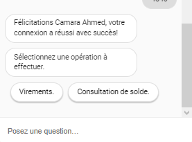

# Dialogflow-ES-Banking-System

### GOAL

The goal of this application was design a chatbot using <a href="https://dialogflow.cloud.google.com/#/getStarted">Dialogflow ES</a> to assist customers in their daily requests made to the bank. In this project, We designed two main features : Transaction requests and Balance inquiries.
To proceed with these two features, the user will first have to be authenticated.
When the user asks for one of these features, the intent containing the authentication flow will automatically be triggered.

#### Balance inquiry

When the user is authenticated, a list of services will be shown and they will be asked to choose the desired service, as shown in the figure below.

When the user chooses to check their balance, automatically the list of all their accounts will be automatically shown. As we know in a bank, a user may have multiple bank accounts. From this list they will choose the relevant  account, and we will send the balance associated with that account to the user

#### Transaction

### NOTES
You may notice that the 'model' folder, which contains the 'chatBotModel.js' file, has been ignored in the '.gitignore' file. This is because the file contains sensitive data that cannot be shared, as well as code to call external endpoints, as this project requires user authentication.